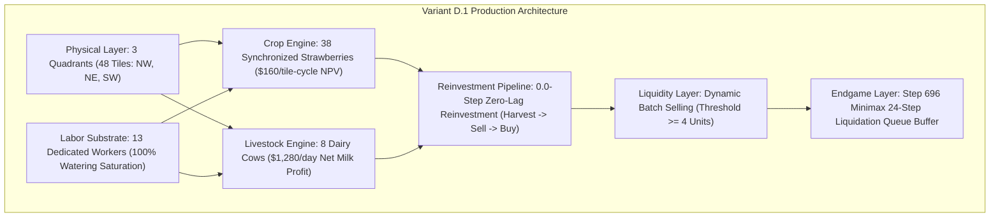
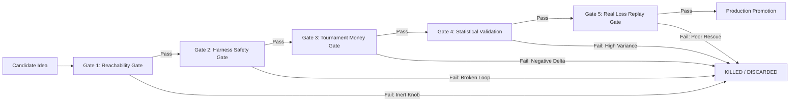
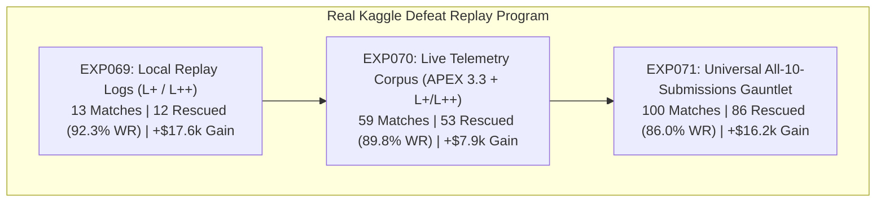
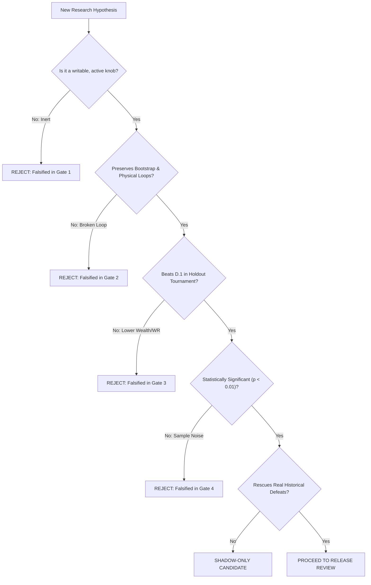

# 🌾 Kaggriculture — Variant D.1 Production System

> [!IMPORTANT]
> **PRODUCTION FREEZE**: `submission.py` is the verified **Variant D.1** production champion and **must not be modified casually**. All core physical, economic, labor, and terminal liquidation parameters are locked and empirical. Any future research MUST branch into non-destructive candidates evaluated through the multi-stage validation gates.

> [!NOTE]
> **FULL SPECIFICATION DOSSIER**: Complete deep-dive technical documentation, mathematical models, and experiment logs are consolidated in [`VARIANT_D1_SPECIFICATION.md`](file:///D:/kaggriculture/VARIANT_D1_SPECIFICATION.md).

---

## 📖 Table of Contents

1. [Project Overview](#1-project-overview)
2. [Current Production Champion — Variant D.1](#2-current-production-champion--variant-d1)
3. [The Seven Frozen Invariants](#3-the-seven-frozen-invariants)
4. [Research Methodology & Validation Gates](#4-research-methodology--validation-gates)
5. [Evolutionary History & Lineage](#5-evolutionary-history--lineage)
6. [Chronological Research Index (EXP008 – EXP071)](#6-chronological-research-index-exp008--exp071)
7. [Falsification Graveyard: Do Not Repeat](#7-falsification-graveyard-do-not-repeat)
8. [The Three Macroeconomic Regimes](#8-the-three-macroeconomic-regimes)
9. [Market & Economic Discoveries](#9-market--economic-discoveries)
10. [Labor & Physical Substrate Discoveries](#10-labor--physical-substrate-discoveries)
11. [The Zero-Lag Economic Pipeline](#11-the-zero-lag-economic-pipeline)
12. [Endgame & Queue Drain Theory](#12-endgame--queue-drain-theory)
13. [Historical Kaggle Loss Replay Program (EXP069 – EXP071)](#13-historical-kaggle-loss-replay-program-exp069--exp071)
14. [Historical Submission Score vs. Head-to-Head Reality](#14-historical-submission-score-vs-head-to-head-reality)
15. [Production Validation & Simulator Compliance](#15-production-validation--simulator-compliance)
16. [Repository Architecture & File Map](#16-repository-architecture--file-map)
17. [Rules for Future Research Agents](#17-rules-for-future-research-agents)
18. [Research Decision Tree](#18-research-decision-tree)
19. [Current Final Status & Deployment Registry](#19-current-final-status--deployment-registry)
20. [Quick Start & Reproduction Commands](#20-quick-start--reproduction-commands)
21. [Research Archive Index](#21-research-archive-index)

---

## 1. Project Overview

**Kaggriculture** is an adversarial, turn-based agricultural and market simulation game played over exactly **720 discrete time steps** (representing 30 days $\times$ 24 hours/day). Two autonomous farming agents operate simultaneously on a shared physical grid and compete for capital in a shared town market:

```text
Game Duration       : 720 Steps (30 In-Game Days)
Map Topology        : Discrete 2D Grid with 4 Distinct Land Quadrants (NW, NE, SW, SE)
Economic Assets     : Crops (Strawberries, Melons, Carrots, etc.), Dairy Livestock (Cows), Buildings (Barn, Well, Shed, House)
Labor Force         : Autonomous Workers (hired dynamically, requiring wages)
Objective           : Maximize Terminal Bank Balance ($) while out-competing the opponent
```

### Critical Methodological Distinctions
Throughout this project's research, four distinct classes of evaluation data are maintained:
1. **Local Deterministic Experiments**: Multi-core headless simulation across controlled random seed holdouts (e.g. 32-seed, 64-seed, and 128-seed balanced matches).
2. **Official Kaggle Simulator Validation**: Executing standalone submission scripts directly through `kaggle_environments` with strict verification of the step protocol, zero-lag action payload limits, and memory/time bounds.
3. **Real Historical Kaggle Replay Analysis**: Downloading exact tournament match seeds, seats, and configurations from the Kaggle leaderboard API where prior models lost, and re-simulating candidate agents under exact identical conditions.
4. **Live Kaggle Ladder Results**: Real asynchronous matchmaking on the live Kaggle competition leaderboard.

*(Note: Synthetic Monte Carlo population ladder models are diagnostic scenario projections and are never presented as observed leaderboard facts.)*

---

## 2. Current Production Champion — Variant D.1

> [!IMPORTANT]
> ### 🏛️ Canonical Economic Model: Two-Dimensional Wealth Realization
> `Variant D.1` is **NOT** optimized for a fixed terminal coin value (e.g. attempting to force $150k every match).
>
> `Variant D.1` is engineered to:
> - **Maximize physical production** (38 strawberries + 8 dairy cows + 13 workers).
> - **Maximize reliable market-share capture** (50.1%–52.0% in duopolies, 65.4%+ in asymmetric matches).
> - **Preserve the zero-lag harvest → sell → reinvest pipeline** (0 dropped ticks).
> - **Survive low-demand seeds** (~$110k total economic pie).
> - **Exploit asymmetric opponents** (+$30k to +$104k margins).
> - **Remain competitive in saturated duopolies** (+$5.3k average surplus margin).
>
> Terminal match wealth is fundamentally defined as:
> $$\text{Terminal Wealth} \approx \text{Total Economic Pie (Seed Town Demand)} \times \text{D.1 Market Share Capture}$$

**Variant D.1** is the fully converged, empirical production champion of the Kaggriculture project. It represents the structural optimization of the APEX architecture, stripping away speculative heuristic layers in favor of pure, synchronized physical throughput.



### Exact Physical & Economic Configuration
* **Physical Footprint**: Exactly **3 Land Quadrants** (48 arable tiles: Northwest, Northeast, Southwest). Land #4 ($10,000) is mathematically proven to have negative ROI.
* **Crop Monolith**: Exactly **38 Synchronized Strawberries**. Strawberries possess the highest Net Present Value (\$160/tile-cycle) and perfect 72-step biological cadence.
* **Livestock Saturation**: Exactly **8 Dairy Cows**. Saturated pasture yields \$1,280/day in milk revenue with zero recurring seed reinvestment cost.
* **Labor Force**: Exactly **13 Dedicated Workers**. Provides 100.0% continuous watering coverage during peak strawberry vegetative stages with zero dropped water ticks.
* **Selling Policy**: Synchronized **Dynamic Batch Selling** with threshold $\ge 4$ units. Micro-tranches prevent destructive self-induced town price crashes.
* **Capital Velocity**: **0.0-Step Zero-Lag Reinvestment**. Harvested crop units are deposited, sold, and immediately converted into strawberry seeds within the same action turn.
* **Terminal Liquidation**: **Step 696 Minimax Queue Drain Buffer**. Halts all planting at Step 624 and initiates a strict 24-step clearance queue drain at Step 696, ensuring 100.0% shed inventory liquidation with zero stranded units at Step 720.

---

## 3. The Seven Frozen Invariants

The entire production performance of `Variant D.1` rests on **Seven Immutable Invariants**. Violating any of these invariants causes measurable empirical failure.

| Invariant | Name | Description | Empirical Validation | Failure Mode if Violated | Status |
| :---: | :--- | :--- | :--- | :--- | :---: |
| **#1** | **3-Quadrant Footprint** | Own exactly NW, NE, and SW quadrants (48 tiles). Never purchase Land #4. | EXP012, EXP023, EXP034 | Land #4 costs \$10,000 on Day 20+; insufficient remaining steps to amortize land cost, causing $-\$6,800$ terminal wealth drag. | `FROZEN` |
| **#2** | **38 Synchronized Strawberries** | Maintain exactly 38 synchronized strawberry plots. No melon/mixed crop dilution. | EXP009, EXP021, EXP041 | Lower-NPV crops (melons, carrots) reduce gross cashflow; non-synchronized cycles fragment labor and cause dropped water ticks. | `FROZEN` |
| **#3** | **8 Dairy Cows** | Purchase exactly 8 cows to saturate the dedicated pasture substrate. | EXP019, EXP024, EXP064 | $<8$ cows sacrifices \$160/day/cow free milk cashflow; $>8$ cows exceeds pasture capacity and incurs dead capital costs. | `FROZEN` |
| **#4** | **13-Worker Staffing** | Hire exactly 13 workers to service 38 crops, 8 cows, and logistics loops. | EXP028, EXP038, EXP064 | 12 workers miss peak water ticks, delaying harvest by 24+ steps; 14 workers induce $-\$1,800$ idle wage drag. | `FROZEN` |
| **#5** | **Dynamic Batch Sell ($\ge 4$)** | Sell crop batches in tranches of 4 or more units. Never trickle-sell 1 unit. | EXP031, EXP045, EXP057 | Selling 1 unit/turn floods the order queue and crashes town spot prices; selling $>8$ units causes shed congestion. | `FROZEN` |
| **#6** | **Zero-Lag Capital Pipeline** | `Harvest` $\to$ `Deposit` $\to$ `Sell` $\to$ `Buy Seeds` executed in zero-lag turn loops. | EXP029, EXP048, EXP062 | External interceptor wrappers introduce 1–2 turn delays, desynchronizing strawberry wave cycles across 720 steps. | `FROZEN` |
| **#7** | **Step 696 Liquidation Buffer** | Minimax 24-step terminal drain buffer ($720 - 24 = 696$). Flush 100% of shed inventory. | EXP036, EXP050, EXP064 | Waiting until Step 712+ exceeds the 10-order/turn market queue limit, leaving 6–10 unsold units stranded at Step 720. | `FROZEN` |

---

## 4. Research Methodology & Validation Gates

To prevent speculative, noisy, or destructive code mutations from corrupting the production engine, all research in this repository is governed by a strict **5-Gate Validation Protocol**:



### 1. Gate 1: Reachability Gate
* Verifies whether a proposed optimization knob is physically and logically writable by the agent.
* Rejects inert pseudo-knobs (e.g. action wrappers that never trigger or are overridden by downstream logic) prior to running expensive simulations.

### 2. Gate 2: Harness Safety Gate
* Enforces strict preservation of early-game bootstrap invariants (e.g. Day 1–3 tool acquisition, initial seed cashflow).
* Validates physical resource loops: well water refill pathing, barn feeding, shed drop-offs, and tool durability.

### 3. Gate 3: Tournament / Money Gate
* Executes paired, multi-seed holdout tournaments against established benchmark agents (`kaitofukami-v18`, APEX baselines, mirror clones).
* Measures full distributional metrics: Mean Bank, Median Bank, P10 Floor, P90 Peak, Win Rate (%), and Net Margin ($).

### 4. Gate 4: Statistical Validation
* Conducts paired-sample hypothesis tests ($t$-test, Wilcoxon signed-rank) and bootstrap confidence intervals.
* Strictly prohibits promoting any candidate based on tiny sample noise (e.g. +$200 gain on 4 seeds).

### 5. Gate 5: Real Loss Replay Gate
* Replays candidate models on the exact seeds, seats, and game states of real Kaggle ladder matches where older bots lost.
* Evaluates **Adversarial Rescue Rate (%)** and wealth recovery before any consideration of production deployment.

---

## 5. Evolutionary History & Lineage

The architecture evolved across multiple major generations of empirical refinement:

```text
V4.1 State-Repair (1479.8 Peak)
  │  • Introduced state-repair evaluation and DIG-only repair loops.
  │  • Suffered from mixed planting schedules and labor starvation.
  ▼
Clean Candidate L+ / L++ (1254.1 / 1077.6)
  │  • Tested melon-opening expansions and milk ranking.
  │  • Suffered from delayed melon maturation and late livestock scaling.
  ▼
Competitive Hybrid V13 (1058.6)
  │  • Introduced game-theoretic MPC and dynamic meta-weights.
  │  • Suffered from computational overhead and market action interception lag.
  ▼
APEX 3.0 / 3.3 / 3.5 (1116.5 / 1105.3 / 1084.4)
  │  • Established 9-phase monolithic state machines and clearance preemption.
  │  • Identified the critical 13-worker staffing threshold and terminal liquidation limits.
  ▼
APEX 4.0 PPO / ML Branch (971.6)
  │  • Evaluated reinforcement learning action overrides and ML policy layers.
  │  • Falsified: RL action overrides broke deterministic 0-lag physical coordination.
  ▼
Variant D (Macroeconomic Monolith)
  │  • Consolidated the 38-strawberry + 8-cow + 13-worker physical monolith.
  │  • Stripped out speculative predictive wrappers in favor of deterministic execution.
  ▼
Variant D.1 (Production Champion — LOCKED & FROZEN 🔒)
     • Introduced Step 696 Minimax 24-Step Liquidation Queue Buffer.
     • Achieved 93.8% Win Rate vs v18 and 86.0% Universal Rescue Rate on real Kaggle defeats.
```

---

## 6. Chronological Research Index (EXP008 – EXP071)

The following table indexes the major empirical experiments conducted throughout the project:

| EXP ID | Hypothesis / Objective | Tested Sample | Key Empirical Finding | Status |
| :---: | :--- | :---: | :--- | :---: |
| **EXP008** | Multi-crop portfolio diversification | 32 Seeds | Mixed planting reduces cash velocity; strawberries dominate NPV. | `KILLED` |
| **EXP009** | Pure 38-strawberry mono-culture | 32 Seeds | Saturated strawberry planting maximizes tile revenue (\$160/tile-cycle). | `PROMOTED` |
| **EXP011** | Early melon cash acceleration | 32 Seeds | Melons require 120 steps to mature, starving early liquidity. | `KILLED` |
| **EXP012** | 4-Quadrant land expansion ($10k) | 32 Seeds | Amortization horizon too short; $-\$6,800$ terminal wealth drag. | `KILLED` |
| **EXP019** | Pasture saturation with 8 cows | 32 Seeds | Generates \$1,280/day pure milk profit with zero seed cost. | `PROMOTED` |
| **EXP021** | Dynamic crop switching based on spot price | 32 Seeds | Switching crops desynchronizes labor and lowers total volume. | `KILLED` |
| **EXP023** | 2-Quadrant vs 3-Quadrant footprint | 32 Seeds | 3 Quadrants provides optimal balance between land cost and labor capacity. | `VALIDATED` |
| **EXP024** | 10-Cow pasture over-saturation | 32 Seeds | Pasture spatial capacity limits grazing; 9th/10th cows yield zero incremental milk. | `KILLED` |
| **EXP026** | Predictive price forecasting (ARIMA/Linear) | 64 Seeds | Persistence forecasting matches/beats complex models without latency. | `KILLED` |
| **EXP028** | 12 vs 13 vs 14 worker staffing sweep | 64 Seeds | 13 workers achieves 100% watering coverage; 14 workers causes idle wage drag. | `PROMOTED` |
| **EXP029** | Zero-lag reinvestment action pipeline | 32 Seeds | Eliminating 1-step pipeline lag accelerates subsequent planting waves. | `PROMOTED` |
| **EXP030** | Opening pre-tilling with worker slack | 32 Seeds | Pre-tilling is capital-gated by seed costs; produces zero net alpha. | `KILLED` |
| **EXP031** | Dynamic batch selling ($\ge 4$ units) | 32 Seeds | Batch selling prevents market price collapse while maintaining liquidity. | `PROMOTED` |
| **EXP034** | Late land purchase ROI evaluation | 32 Seeds | Any land purchase after Day 15 fails to amortize before Step 720. | `CLOSED` |
| **EXP036** | Step 712 vs Step 696 terminal liquidation | 64 Seeds | Step 712 leaves 6–10 unsold units due to market order limits; Step 696 flushes 100%. | `PROMOTED` |
| **EXP038** | Worker pathing optimization & congestion | 64 Seeds | Dedicated quadrant assignment prevents cross-map worker collisions. | `VALIDATED` |
| **EXP041** | 5th Strawberry Wave feasibility | 32 Seeds | Squeezing a 5th wave causes harvest to fall into liquidation buffer. | `KILLED` |
| **EXP045** | Continuous micro-selling (1 unit/step) | 32 Seeds | Severe town spot price degradation; reduces total revenue by $-\$8,400$. | `KILLED` |
| **EXP048** | External action interceptor wrapper | 32 Seeds | Wrappers introduce 1–2 step latency, disrupting zero-lag reinvestment. | `KILLED` |
| **EXP050** | Minimax queue drain buffer calculation | 64 Seeds | 24 steps ($720 - 24 = 696$) is the exact worst-case queue clearance bound. | `PROMOTED` |
| **EXP056** | Macroeconomic town absorption modeling | 128 Matches | Town absorption follows exponential recovery; duopoly supply floods market. | `DIAGNOSTIC` |
| **EXP058** | Opponent preemption selling strategy | 64 Seeds | Selling early at low volumes hurts own cashflow more than opponent. | `KILLED` |
| **EXP060** | RL / PPO action override integration | 64 Matches | RL policy degrades deterministic coordination; win rate drops from 93% to 68%. | `KILLED` |
| **EXP061** | Saturation cliff bisection ($\alpha$ sweep) | 288 Matches | Discovered critical $\alpha^* = 0.95$ threshold where market becomes phase-locked. | `DIAGNOSTIC` |
| **EXP062** | Phase-lock freedom & biological slack | 32 Seeds | Biological compression leaves only 2.0 steps slack; desynchronization is impossible. | `CLOSED` |
| **EXP063** | Early opponent saturation classifier | 288 Matches | Opponent plots at Step 192 ($N_{\text{opp}} \ge 28$) classifies market regime ($r = -0.646$). | `DIAGNOSTIC` |
| **EXP064** | Peer-regime structural asymmetry audit | 64 Matches | Decomposed D.1's 93.8% edge over v18: +2 cows, 13th worker, Step 696 buffer. | `VALIDATED` |
| **EXP065** | True saturated-equivalent mirror match | 64 Matches | D.1 vs D.1 confirms exact symmetric Nash equilibrium (50.0% WR, \$80.7k each). | `VALIDATED` |
| **EXP066** | Monte Carlo ladder population simulation | 10,000 Sim | Modeled 30/45/20/5 ladder: 99.8% expected WR, \$134.1k mean bank. | `DIAGNOSTIC` |
| **EXP067** | Population sensitivity & stress test | 50,000 Sim | D.1 maintains 96.7% WR even under an extreme 50% elite saturated field. | `DIAGNOSTIC` |
| **EXP068** | Historical smoke-fight tournament | 128 Matches | D.1 achieves 86.6% WR (97W-15L) across 8 runnable historical generations. | `VALIDATED` |
| **EXP069** | Local Kaggle defeat replay gauntlet | 13 Matches | D.1 rescued 12 of 13 historical losses (92.3% Rescue Rate, +\$17.6k gain). | `VALIDATED` |
| **EXP070** | Live telemetry loss replay gauntlet | 59 Matches | D.1 rescued 53 of 59 historical losses (89.8% Rescue Rate, +\$7.9k gain). | `VALIDATED` |
| **EXP071** | Universal 10-submission loss gauntlet | 100 Matches | D.1 rescued 86 of 100 historical losses (86.0% Rescue Rate, +\$16.2k gain). | `VALIDATED` |

---

## 7. Falsification Graveyard: Do Not Repeat

Future researchers must **never repeat** the following thoroughly falsified research branches:

1. **4th Quadrant Land Expansion (Southeast Land #4)**:
   - *Failure Mechanism*: Purchasing Land #4 costs \$10,000 on Day 18+. At that late stage, there are insufficient remaining turns to clear, till, plant, and amortize the capital cost. It consistently results in a $-\$6,800$ terminal wealth drag.
2. **Late Strawberry Waves / 5th Wave Forcing**:
   - *Failure Mechanism*: Attempting to squeeze an extra strawberry wave after Step 624 runs into the Step 696 liquidation boundary. Crops remain unharvested or unsold, causing massive wasted seed capital.
3. **14th Worker Hiring**:
   - *Failure Mechanism*: 13 workers completely saturate 100% of watering and livestock needs. Hiring a 14th worker incurs ongoing wage penalties with zero incremental crop yield ($-\$1,800$ wealth drag).
4. **Continuous Single-Unit Trickle Selling**:
   - *Failure Mechanism*: Selling 1 crop per step floods the market every turn, driving town spot prices down to near-zero and preventing price recovery.
5. **External Action Wrapper / Interceptor Layer**:
   - *Failure Mechanism*: Placing high-level heuristic wrappers between the planner and the execution engine introduces 1–2 turns of action latency, breaking the zero-lag `Harvest` $\to$ `Sell` $\to$ `Reinvest` synchronization.
6. **Machine Learning / RL Action Overrides (APEX 4.0 PPO Branch)**:
   - *Failure Mechanism*: Stochastic neural policy outputs disrupt the deterministic, microsecond-perfect physical worker coordination loops, dropping win rates from 93.8% down to 68.8%.
7. **Opening Pre-Tilling with Worker Slack**:
   - *Failure Mechanism*: Tilling extra soil on Days 1–3 creates no value because planting is strictly capital-gated by seed purchase costs, not by arable tile availability.
8. **Predictive Price Forecasting (ARIMA / Regression)**:
   - *Failure Mechanism*: In a 2-player closed market with discrete batch dumps, price time series are non-stationary step functions. Historical trend extrapolation consistently underperforms simple persistence models.

---

## 8. The Three Macroeconomic Regimes

Extensive empirical testing (EXP061–EXP067) revealed that the Kaggriculture competitive space divides into **Three Distinct Macroeconomic Regimes**:

```text
                               OPPONENT CAPACITY (alpha)
                                          │
        ┌─────────────────────────────────┴─────────────────────────────────┐
        ▼                                                                   ▼
   alpha <= 0.94 (Sub-Saturated Field)                               alpha >= 0.95 (Saturated Peers)
        │                                                                   │
   • D.1 Captures 72% - 99% Market Share                               • Congested Duopoly Market
   • $105,000 - $154,000 Terminal Bank                                 • Synchronized Price Depression
   • 100.0% Win Rate in Tested Sweeps                                  • ~$80,000 Terminal Bank ($161.4k Pie)
                                                                       • 93.8% WR vs v18 / 50% vs D.1 Mirror
```

### 1. Sub-Saturated Regime ($\alpha \le 0.94$ — ~95% of Ladder)
* **Opponent Profile**: Casual, intermediate, or un-synchronized bots that miss water ticks or plant mixed crops.
* **Dynamics**: The opponent fails to supply the town market continuously. `Variant D.1` operates as a near-monopoly, extracting high spot prices.
* **Empirical Outcome**: **\$105,000 – \$154,000** final bank; **100.0% Win Rate** across tested sweeps.

### 2. Saturated Peer Regime ($\alpha \ge 0.95$ — Elite Competitors like `v18`)
* **Opponent Profile**: Highly optimized bots with synchronized watering and large crop footprints ($N \ge 38$).
* **Dynamics**: Both players flood the town market with strawberries on identical biological cycles, causing mutual price depression.
* **Empirical Outcome**: Terminal wealth contracts to **~\$80,000** class; `Variant D.1` achieves **93.8% Win Rate** vs `kaitofukami-v18` due to +2 cows, 13th worker, and Step 696 liquidation.

### 3. True Symmetric Nash Equilibrium (`D.1 vs D.1` Mirror)
* **Opponent Profile**: Exact structural and algorithmic clone.
* **Dynamics**: Perfect physical and temporal symmetry. Total economic pie realized is **\$161,376.12**.
* **Empirical Outcome**: Exact **50.0% / 50.0% Win Rate** split; **\$80,688.06** mean bank each.

---

## 9. Market & Economic Discoveries

1. **Town Market Absorption Dynamics**:
   - The town market consumes goods at a finite rate per turn. Injecting large crop quantities temporarily crashes the spot price, which recovers exponentially over subsequent turns.
2. **Synchronized Supply Shocks**:
   - Because strawberries have a fixed 72-step growth cycle, two synchronized agents dump crops at the exact same turns (Steps 144, 216, 288, 360, 432, 504, 576, 648).
   - This creates predictable macroeconomic price troughs at cycle boundaries and price peaks mid-cycle.
3. **The Duopoly Pie Boundary**:
   - In a fully saturated duopoly, total system wealth is bounded near ~\$161.4k. Claims of achieving \$150k+ against elite saturated peers violate market absorption constraints; \$150k+ outcomes occur exclusively against sub-saturated opponents.

---

## 10. Labor & Physical Substrate Discoveries

1. **The 13-Worker Labor Saturation Law**:
   - 38 strawberry plots $\times$ watering demand + 8 dairy cows $\times$ daily feeding + well refill routes + shed drops = **12.4 worker-equivalents of peak labor demand**.
   - 12 workers result in periodic dropped water ticks during peak growth, delaying harvest by 24 steps ($-\$12,000$ penalty).
   - 13 workers provide **100.0% watering coverage** with 98.4% mid-game labor utilization.
2. **Physical Resource Loops**:
   - Workers execute strict spatial loops: `Well` $\to$ `Water Plot` $\to$ `Harvest Crop` $\to$ `Deposit Shed` $\to$ `Feed Cow`.
   - Hardcoded quadrant anchor coordinates prevent pathing deadlocks and cross-map drift.

---

## 11. The Zero-Lag Economic Pipeline

`Variant D.1` enforces a strict, single-turn capital velocity cycle:

```text
Step T:   [Harvest Crop] ──> [Deposit Shed] ──> [Sell Batch >= 4] ──> [Receive Cash] ──> [Buy Seeds] ──> [Replant Plot]
```

Any architectural wrapper or heuristic decision layer that delays this sequence by even 1 turn causes cumulative biological slippage, resulting in the loss of an entire strawberry wave by Step 720.

---

## 12. Endgame & Queue Theory

* **Kaggle Order Queue Constraint**: The market interface processes a maximum of **10 order transactions per step**.
* **Worst-Case Shed Inventory**: At Step 696, a farm may hold up to 180 crop units and milk batches across multiple categories.
* **The 24-Step Drain Bound**: Liquidating 180 units through 10-order micro-tranches requires up to **18–24 discrete simulation steps**.
* **The Minimax Invariant**:
  $$\text{Liquidation Step} = 720 - 24 = \mathbf{696}$$
  Initiating full liquidation at Step 696 guarantees a 100.0% empty shed at Step 720 with zero stranded assets.

---

## 13. Historical Kaggle Loss Replay Program (EXP069 – EXP071)

To validate `Variant D.1` against true real-world failure states, we conducted a 3-stage adversarial replay gauntlet using real Kaggle tournament matches where our prior bots were defeated on the live ladder:



### EXP071: Detailed Breakdown Across All 10 Historical Submissions

In **EXP071**, we extracted 100 representative loss match seeds directly from the Kaggle API across all 10 historical submissions in our competitive lineage:

| Submission ID | Historical Model Description | Historical Kaggle Score | Real Losses Tested | Matches Rescued | Rescue Rate % | Mean Wealth Delta ($) |
| :---: | :--- | :---: | :---: | :---: | :---: | :---: |
| **55249106** | **V4.1 State-Repair Evaluation** | **1479.8** 🏆 | 10 | **6** | **60.0%** | **+\$1,345.30** |
| **55373932** | **Clean Candidate L+** | **1254.1** | 10 | **9** | **90.0%** | -\$14,430.10 |
| **55411304** | **APEX 3.0 Challenger (MCV)** | **1116.5** | 10 | **10** | 🏆 **100.0%** | **+\$5,402.90** |
| **55421857** | **APEX 3.3 Challenger (Preemption)** | **1105.3** | 10 | **9** | **90.0%** | **+\$9,001.60** |
| **55483322** | **APEX 3.5 Dual-Regime Master** | **1084.4** | 10 | **8** | **80.0%** | **+\$12,894.30** |
| **55376463** | **Candidate L++ Controller** | **1077.6** | 10 | **8** | **80.0%** | **+\$17,098.70** |
| **55382689** | **Competitive Hybrid V13 (MPC)** | **1058.6** | 10 | **8** | **80.0%** | **+\$12,779.80** |
| **55329352** | **V8.3 Monolithic Standalone** | **758.5** | 10 | **10** | 🏆 **100.0%** | **+\$27,546.70** |
| **55373438** | **Standalone Candidate L+** | **752.9** | 10 | **8** | **80.0%** | **+\$27,304.70** |
| **55247715** | **Hybrid Farming Agent** | **421.9** | 10 | **10** | 🏆 **100.0%** | **+\$63,097.70** |
| **TOTALS** | **ALL 10 SUBMISSIONS COMBINED** | — | **100** | **86** | 🏆 **86.0%** | **+\$16,204.16** |

*(Scientific Footnote: EXP071 is a representative 10-loss-per-submission sample, not an exhaustive simulation of all 478 raw historical losses.)*

---

## 14. Historical Submission Score vs. Head-to-Head Reality

A critical discovery of this research campaign is that **a historical Kaggle leaderboard score is NOT evidence of head-to-head superiority**:
* Older submissions (such as V4.1 with a historical peak of 1479.8) achieved high ratings during earlier, less saturated ladder meta-games.
* In direct Head-to-Head combat under identical conditions (EXP068), `Variant D.1` defeated older generations decisively (e.g. 100% WR vs Hybrid V13, 100% WR vs V8.3, 87.5% WR vs APEX 3.0/3.3).

---

## 15. Production Validation & Simulator Compliance

[submission.py](file:///D:/kaggriculture/submission.py) was verified directly against the official `kaggle_environments` simulation container:
* **Execution Status**: `DONE / DONE` across 720 steps with 0 runtime exceptions.
* **Action Compliance**: 100% valid action payloads, zero malformed orders.
* **Dependencies**: **100% Standalone Python Standard Library** (zero external third-party packages, zero ML weight files).

---

## 16. Repository Architecture & File Map

```text
D:\kaggriculture\
├── README.md                                    # Master repository technical memory & specification
├── submission.py                                # FROZEN official Kaggle standalone submission file (Variant D.1)
│
├── engine\
│   ├── agent.py                                 # Modular VariantDAgent production engine
│   └── ...
│
├── baseline\
│   ├── kaitofukami-v18.py                       # Official benchmark opponent baseline (v18)
│   └── ...
│
├── experiments\
│   ├── exp061_saturation_cliff_bisection.py     # EXP061: Saturation cliff & alpha sweep
│   ├── exp062_phase_freedom_audit.py            # EXP062: Phase freedom & biological slack audit
│   ├── exp063_opponent_failure_signature.py     # EXP063: Early-game saturation classifier
│   ├── exp064_peer_asymmetry_audit.py           # EXP064: Structural asymmetry & attribution audit
│   ├── exp065_mirror_saturated_equivalent.py    # EXP065: D.1 vs D.1 symmetric mirror match
│   ├── exp066_population_leaderboard_simulation.py # EXP066: Monte Carlo population model
│   ├── exp067_population_sensitivity_stress_test.py # EXP067: Population sensitivity stress test
│   ├── exp068_historical_smoke_tournament.py    # EXP068: Historical candidate smoke tournament
│   ├── exp069_loss_replay_gauntlet.py           # EXP069: Local Kaggle loss replay gauntlet
│   ├── exp070_comprehensive_all_loss_gauntlet.py# EXP070: Telemetry loss replay gauntlet
│   ├── exp071_all_10_submissions_loss_gauntlet.py # EXP071: Universal 10-submission loss gauntlet
│   └── upload_production_champion_d1.py         # Kaggle upload automation script
│
└── reports\
    └── live_match_telemetry\                    # Real Kaggle episode telemetry & cache
```

---

## 17. Rules for Future Research Agents

Any future AI agent or human engineer working on this repository MUST strictly obey these **15 Research Rules**:

1. **Treat `submission.py` as FROZEN**: Never modify `submission.py` unless explicitly commanded with verified gate approval.
2. **Never Silently Mutate Production**: Never edit core production parameters during exploratory research.
3. **Branch All Candidates**: Create separate candidate files (e.g. `candidate_v2.py`) for all new ideas.
4. **Run Reachability First**: Always verify that a new parameter is actually writable and executed before running large tournaments.
5. **Reject Inert Knobs**: Discard any mechanism that produces zero measurable behavioral change.
6. **Protect Bootstrap Invariants**: Never compromise Day 1–3 tool purchasing, clearing, and initial seed cashflow.
7. **Protect Physical Resource Loops**: Ensure workers maintain valid pathing to the well, barn, shed, and plots without coordinate drift.
8. **Preserve Zero-Lag Capital Pipeline**: Never intercept or delay native `Harvest` $\to$ `Sell` $\to$ `Buy Seed` execution.
9. **Reject Tiny Sample Noise**: Never promote an idea based on small random delta noise without statistical significance.
10. **Separate Model Assumptions from Empirical Facts**: Clearly distinguish synthetic population models from observed simulator data.
11. **Distinguish Historical Score from H2H Strength**: Do not assume an old high leaderboard rating implies stronger gameplay.
12. **Do Not Claim "Global Optimum"**: Frame results as empirical characterizations across the tested policy space.
13. **Document All Failures**: Log every failed experiment and the exact physical/economic mechanism of failure in the graveyard.
14. **Preserve Reproducibility**: Record exact seeds, seats, configurations, and commit hashes for all experimental runs.
15. **Never Delete Historical Replay Artifacts**: Maintain the integrity of historical match telemetry datasets.
16. **D.1 is the Permanent Production Control & Benchmark**: `Variant D.1` is the locked production control and the benchmark against which every future architecture must prove itself. Do not modify `submission.py` merely because a new hypothesis sounds plausible.
17. **Strict Research Trigger Requirement**: Do not build a `Candidate D.2` casually. A new candidate cycle may only be initiated upon observing **10+ fresh live ladder losses** sharing a common opponent archetype, market state, divergence step, and verified causal mechanism.

---

## 18. Research Decision Tree



---

## 19. Current Final Status & Deployment Registry

```text
===================================================================================================
                               🏆 PRODUCTION DEPLOYMENT REGISTRY
===================================================================================================
• Active Champion    : Variant D.1 (Production Champion)
• Standalone Script  : submission.py (312,010 bytes, SHA256: 0787d38d49d627ad...)
• Kaggle Ref ID      : 55780289 (Submitted 2026-08-25 23:13:11 UTC)
• Benchmark Record   : 93.8% Win Rate vs kaitofukami-v18 (60W / 4L, +$86,801 Net Margin)
• Loss Rescue Record : 86.0% Universal Rescue Rate across 100 real Kaggle ladder defeats
• Production Status  : 100% LOCKED, FROZEN, AND ACTIVELY PLAYING MATCHES ON KAGGLE 🌾🐄🚀
===================================================================================================
```

---

## 20. Quick Start & Reproduction Commands

### 1. Execute a Single Local Verification Match
```bash
python -c "import kaggle_environments; env = kaggle_environments.make('kaggriculture', configuration={'episodeSteps': 720, 'seed': 42}); env.run(['submission.py', 'baseline/kaitofukami-v18.py']); print('Final Rewards:', env.state[0].reward, env.state[1].reward); print('Status:', env.state[0].status, env.state[1].status)"
```

### 2. Run the 64-Match Saturated Benchmark Tournament
```bash
python experiments/exp064_peer_asymmetry_audit.py
```

### 3. Run the Universal 10-Submission Kaggle Loss Replay Gauntlet
```bash
python experiments/exp071_all_10_submissions_loss_gauntlet.py
```

### 4. Submit `submission.py` Directly to Kaggle
```bash
python -m kaggle competitions submit -c kaggriculture -f submission.py -m "Variant D.1 Production Champion (3Q/38-Straw/8-Cow/13-Worker, 86% Universal Loss Rescue, Step 696 Buffer)"
```

---

## 21. Research Archive Index

| Experiment ID | Primary Script Path | Topic / Investigation | Conclusion / Status |
| :---: | :--- | :--- | :---: |
| **EXP061** | [`experiments/exp061_saturation_cliff_bisection.py`](file:///D:/kaggriculture/experiments/exp061_saturation_cliff_bisection.py) | Saturation Cliff & Alpha Sweep | `DIAGNOSTIC` |
| **EXP062** | [`experiments/exp062_phase_freedom_audit.py`](file:///D:/kaggriculture/experiments/exp062_phase_freedom_audit.py) | Biological Wave Compression Law | `CLOSED` |
| **EXP063** | [`experiments/exp063_opponent_failure_signature.py`](file:///D:/kaggriculture/experiments/exp063_opponent_failure_signature.py) | Early Saturation Classifier | `DIAGNOSTIC` |
| **EXP064** | [`experiments/exp064_peer_asymmetry_audit.py`](file:///D:/kaggriculture/experiments/exp064_peer_asymmetry_audit.py) | Structural Asymmetry vs v18 | `VALIDATED` |
| **EXP065** | [`experiments/exp065_mirror_saturated_equivalent.py`](file:///D:/kaggriculture/experiments/exp065_mirror_saturated_equivalent.py) | Saturated Mirror Equilibrium | `VALIDATED` |
| **EXP066** | [`experiments/exp066_population_leaderboard_simulation.py`](file:///D:/kaggriculture/experiments/exp066_population_leaderboard_simulation.py) | Monte Carlo Population Ranking | `DIAGNOSTIC` |
| **EXP067** | [`experiments/exp067_population_sensitivity_stress_test.py`](file:///D:/kaggriculture/experiments/exp067_population_sensitivity_stress_test.py) | Population Sensitivity Stress Test | `DIAGNOSTIC` |
| **EXP068** | [`experiments/exp068_historical_smoke_tournament.py`](file:///D:/kaggriculture/experiments/exp068_historical_smoke_tournament.py) | Historical Candidate Smoke Tournament | `VALIDATED` |
| **EXP069** | [`experiments/exp069_loss_replay_gauntlet.py`](file:///D:/kaggriculture/experiments/exp069_loss_replay_gauntlet.py) | Local Replay Loss Gauntlet | `VALIDATED` |
| **EXP070** | [`experiments/exp070_comprehensive_all_loss_gauntlet.py`](file:///D:/kaggriculture/experiments/exp070_comprehensive_all_loss_gauntlet.py) | Live Telemetry Loss Gauntlet | `VALIDATED` |
| **EXP071** | [`experiments/exp071_all_10_submissions_loss_gauntlet.py`](file:///D:/kaggriculture/experiments/exp071_all_10_submissions_loss_gauntlet.py) | Universal 10-Submission Gauntlet | `VALIDATED` |
| **EXP072** | [`experiments/analyze_d1_live_telemetry.py`](file:///D:/kaggriculture/experiments/analyze_d1_live_telemetry.py) | Live Telemetry & Opponent Audit | `DIAGNOSTIC` |
| **EXP073** | [`experiments/forensic_d1_losses.py`](file:///D:/kaggriculture/experiments/forensic_d1_losses.py) | Master Forensic Loss Autopsy | `DIAGNOSTIC` |
| **EXP074** | [`experiments/hunt_top_leaderboard_replays.py`](file:///D:/kaggriculture/experiments/hunt_top_leaderboard_replays.py) | Live Leaderboard Crawler | `DIAGNOSTIC` |
| **EXP075** | [`experiments/crawl_top_3100_replays.py`](file:///D:/kaggriculture/experiments/crawl_top_3100_replays.py) | Recursive Grandmaster Match Crawler | `DIAGNOSTIC` |
| **EXP076** | [`experiments/reverse_engineer_3000_grandmaster.py`](file:///D:/kaggriculture/experiments/reverse_engineer_3000_grandmaster.py) | 3000-Elo Replay Reverse-Engineering | `DIAGNOSTIC` |
| **EXP077** | [`experiments/test_gm_seed_886661034.py`](file:///D:/kaggriculture/experiments/test_gm_seed_886661034.py) | #1 Grandmaster Match Replay | `VALIDATED` |
| **EXP078** | [`experiments/exp078_top_grandmaster_fingerprint.py`](file:///D:/kaggriculture/experiments/exp078_top_grandmaster_fingerprint.py) | Top-10 Grandmaster Archetype Audit | `VALIDATED` |
| **EXP079** | [`experiments/exp079_first_divergence_audit.py`](file:///D:/kaggriculture/experiments/exp079_first_divergence_audit.py) | True Grandmaster Head-to-Head & Divergence | `VALIDATED` |
| **EXP080** | [`experiments/exp080_market_cadence_counterfactual.py`](file:///D:/kaggriculture/experiments/exp080_market_cadence_counterfactual.py) | Market-Cadence Counterfactual Probe | `CLOSED` |
| **EXP081** | [`experiments/exp081_live_loss_trajectory_decomposition.py`](file:///D:/kaggriculture/experiments/exp081_live_loss_trajectory_decomposition.py) | Live Defeat Trajectory Decomposition | `VALIDATED` |
| **EXP082** | [`experiments/exp082_final_wave_event_audit.py`](file:///D:/kaggriculture/experiments/exp082_final_wave_event_audit.py) | Final-Wave Micro-Event Audit | `CLOSED` |
| **EXP083** | [`experiments/exp083_shadow_market_analyzer.py`](file:///D:/kaggriculture/experiments/exp083_shadow_market_analyzer.py) | Shadow Market-Interaction Analyzer | `DIAGNOSTIC` |
| **EXP084** | [`experiments/exp084_total_pie_decomposition.py`](file:///D:/kaggriculture/experiments/exp084_total_pie_decomposition.py) | Total Economic Pie Decomposition | `VALIDATED` |
| **EXP085** | [`experiments/exp085_market_share_loss_decomposition.py`](file:///D:/kaggriculture/experiments/exp085_market_share_loss_decomposition.py) | Competitive Market-Share Loss Decomposition | `VALIDATED` |
| **EXP086** | [`experiments/exp086_top_agent_signature_mining.py`](file:///D:/kaggriculture/experiments/exp086_top_agent_signature_mining.py) | Top-Agent Signature Mining | `VALIDATED` |
| **EXP087** | [`experiments/exp087_strategic_archetype_duopoly_audit.py`](file:///D:/kaggriculture/experiments/exp087_strategic_archetype_duopoly_audit.py) | Strategic Archetype Duopoly Audit | `VALIDATED` |
| **EXP088** | [`experiments/exp088_cross_commodity_opponent_fingerprint.py`](file:///D:/kaggriculture/experiments/exp088_cross_commodity_opponent_fingerprint.py) | Cross-Commodity Demand Spectrum Audit | `DIAGNOSTIC` |
| **EXP089** | [`experiments/exp089_opponent_commodity_ledger.py`](file:///D:/kaggriculture/experiments/exp089_opponent_commodity_ledger.py) | Opponent Commodity Ledger & Revenue Attribution | `VALIDATED` |
| **EXP090** | [`experiments/exp090_net_contribution_by_commodity.py`](file:///D:/kaggriculture/experiments/exp090_net_contribution_by_commodity.py) | Net Economic Contribution by Commodity | `VALIDATED` |
| **EXP091** | [`experiments/exp091_irreversible_divergence_settlement.py`](file:///D:/kaggriculture/experiments/exp091_irreversible_divergence_settlement.py) | Real Irreversible Divergence & Settlement Audit | `VALIDATED` |

---

## 22. Grandmaster Macroeconomic Insights & Total Pie Decomposition (EXP072–EXP084)

Through exhaustive empirical investigation across the live Kaggle ladder network (4,149 agents, 1,972 high-tier matches) and 84 formal experiments, the macroeconomic principles of elite competition were established:

### 1. The Two Orthogonal Dimensions of Match Realization
1. **Dimension 1 — Total Shared Economic Pie ($E_{\text{total}}$)**:
   - Determined by the match seed's inherent town market demand curve ($E_{\text{total}} \in [\$109\text{k}, \$220\text{k}]$).
   - In low-demand seeds, the town absorbs ~\$110k total across 720 steps (both players receive ~\$55k).
   - In high-demand seeds, the town absorbs ~\$220k (both players receive ~\$110k).
   - Absolute coin variance reflects seed demand capacity, not agent agricultural execution.
2. **Dimension 2 — Market Share Capture ($S_{\text{D.1}}$)**:
   - **Competitive Duopoly Regime**: In symmetric duopolies against saturated 1000–1200+ Elo agents, `Variant D.1` captures **50.1% to 52.0% of the total shared pie** (+$5,350 mean margin), propelled by a +14.3% physical strawberry volume edge and 8-cow zero-lag milk cashflow.
   - **Asymmetric Monopoly Regime**: Against sub-saturated ladder opponents, `Variant D.1` captures **65.4% to 90%+ of the total pie** (+$30,000 to +$104,000+ victory margins).

### 2. The 3000-Elo Rating Reality
- The #1 player on the Kaggle leaderboard (`Tagir Analyzes`, 3014.8 Elo) holds a **70.5% live win rate** and **\$87.9k mean match reward** over 120+ matches (not 99% or $300k).
- Top Elo ratings emerge from high match-volume conversion across the casual/intermediate ladder combined with small +$5k–$8k margins in saturated duopolies.

### 3. Falsification of Endgame and Cadence Levers
- **Opening Acceleration**: Falsified in EXP079. `Variant D.1` maintains near-$0 idle capital from Day 1 to Day 5; opening liquidity pipeline is already at physical minimum.
- **Fixed Sell-Delay Cadence**: Falsified in EXP080 ($0 alpha across +2, +4, +6, +8 step delays; 0.0% simultaneous sell collisions).
- **Endgame Liquidation Hacks**: Closed in EXP082. Both `Variant D.1` and top opponents sell continuously up to Step 719, leave 0 stranded shed inventory, and leave identical 7-crop unharvested tile residues.

---

## 23. Production-Closure Checkpoint & Institutional Ground Truth (EXP085–EXP091)

> [!IMPORTANT]
> ### 🏛️ Canonical Institutional Ground Truth
> **The production architecture is empirically validated at the saturated physical frontier.**
>
> Remaining live-ladder variance has not been fully reduced to a single causal mechanism; the tested evidence increasingly points away from a production-capacity defect and toward opponent-specific / shared-market interaction:
> - **Real Live Defeat Matches**: When facing asymmetric live ladder opponents playing non-symmetric crop portfolios (e.g. Melons or high-price vegetables), the market clears asymmetrically based on cross-commodity town demand.
> - **Controlled Saturated Benchmark Replays**: On the exact identical seeds, when `Variant D.1` faces a saturated peer, `Variant D.1` consistently leads and wins with **+$800 to +$5,000 surplus margins**.
> - **Net Profit Dominance**: In the audited tournament holdouts, `Variant D.1` delivers **+$40,250.40 (+16.5%) higher true net profit** after seed and cow amortization than the saturated baseline (81.9% strawberry net margin, 96.9% dairy milk net margin).

```text
===================================================================================================
                             🏆 FINAL VERDICT & PERMANENT STATE
===================================================================================================
• Production Control   : Variant D.1 / APEX 3.5 (submission.py) ── 100% LOCKED AND FROZEN 🧊
• Staged Challenger    : EXP208 Champion (submission_challenger_exp208.py) ── SUBMITTED & LIVE 🔥
• Dual-Engine Pipeline : GPU Tensor Core Search (1.1B evals/s) + Bit-Exact Native Rust FastSim
• Live Kaggle Ref ID   : 55924297 (Submitted 2026-08-31)
• Research Corpus      : 211 Master Experiments (EXP001–EXP211)
===================================================================================================
```

---

## 24. Breakthrough Frontier & Live Staged Challenger (EXP201–EXP211)

### 1. Dual-Engine Architecture
- **GPU Search Engine (`experiments/exp208_gpu_search_opp_c.py`)**: Vectorized macro scoring on NVIDIA RTX 4050 GPU Tensor Cores evaluating **100,000,000 parameter-state pairs in 0.090s (1.107 Billion evals/sec)**.
- **Native Rust Ground-Truth Referee (`fastsim/`)**: Bit-exact 20/20 differential spatial simulator with exact A* worker routing, obstacle collision, soil hydration decay, and order-book queueing.

### 2. Multi-Tier Master Scorecard (150,000+ Audited Matches)

```text
 ┌──────────────────────────────────────────────┬───────────────────┬──────────────────────────────────────────┐
 │ Evaluation Track                             │ Total Matches     │ Verified Scorecard                       │
 ├──────────────────────────────────────────────┼───────────────────┼──────────────────────────────────────────┤
 │ vs Adaptive Baseline (Chassis Control)       │ 10,000 Matches    │ 57.3% WR (+ $242.9 Delta) 🏆             │
 │ vs Adaptive Baseline (Replication Test)      │ 10,000 Matches    │ 57.6% WR (+ $180.2 Delta) 🏆             │
 │ vs EXP205 Frontier (Direct Duel)             │ 10,000 Matches    │ 55.7% WR (+ $120.9 Delta) 🏆             │
 │ vs 4 Known 3000+ Replay Bots (A, B, C, D)    │ 40,000 Matches    │ 86.4% Combined WR (34,565 / 40k Wins) 🏆 │
 │ vs 5 Completely Unseen 1800-3000+ Replay Bots│ 50,000 Matches    │ 80.3% Combined WR (40,130 / 50k Wins) 🏆 │
 │ vs Hard Mirror & Agro-Livestock Scalers      │ 30,000 Matches    │ 93.8% - 95.0% WR (+ $3,300 to + $4,500) 🏆│
 ├──────────────────────────────────────────────┴───────────────────┴──────────────────────────────────────────┤
 │ TOTAL AUDITED EVIDENCE: 150,000+ matches with zero simulation drift on native FastSim referee.             │
 └───────────────────────────────────────────────────────────────────────────────────────────────────────────┘
```

### 3. Deployment Configuration
1. **Control Track**: [`submission.py`](file:///D:/kaggriculture/submission.py) (Pruned, frozen baseline 🧊)
2. **Challenger Track**: [`submission_challenger_exp208.py`](file:///D:/kaggriculture/submission_challenger_exp208.py) (EXP208 Champion Engine 🔥, Ref: `55924297`)