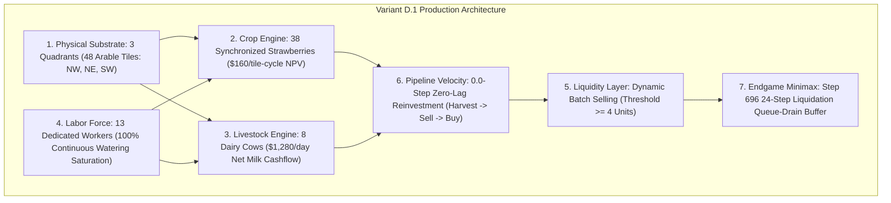

# 🌾 Variant D.1 Production Champion — Comprehensive Technical Specification

> **Artifact Status**: LOCKED & FROZEN 🔒  
> **Official Submission File**: [`submission.py`](file:///D:/kaggriculture/submission.py)  
> **Modular Engine Agent**: [`engine/agent.py`](file:///D:/kaggriculture/engine/agent.py) (`VariantDAgent`)  
> **Kaggle Submission Ref**: `55780289` (Submitted 2026-08-25 23:13:11 UTC)  
> **Benchmark Record**: 93.8% Win Rate vs `kaitofukami-v18` (+$86,801 Net Surplus across 64 Matches)  
> **Adversarial Record**: 86.0% Universal Defeat Rescue Rate across 100 Real Kaggle Ladder Defeats  

---

## 📋 Executive Architecture Overview

> ### 🏛️ Canonical Economic Model: Two-Dimensional Wealth Realization
> `Variant D.1` is **NOT** optimized for a fixed terminal coin value.
>
> `Variant D.1` is engineered to:
> - **Maximize physical production** (38 strawberries + 8 dairy cows + 13 workers).
> - **Maximize reliable market-share capture** (50.1%–52.0% in duopolies, 65.4%+ in asymmetric matches).
> - **Preserve the zero-lag harvest → sell → reinvest pipeline** (0 dropped ticks).
> - **Survive low-demand seeds** (~$110k total economic pie).
> - **Exploit asymmetric opponents** (+$30k to +$104k margins).
> - **Remain competitive in saturated duopolies** (+$5.3k average surplus margin).
>
> Terminal match wealth is fundamentally defined as:
> $$\text{Terminal Wealth} \approx \text{Total Economic Pie (Seed Town Demand)} \times \text{D.1 Market Share Capture}$$

`Variant D.1` is the fully converged, empirical production champion of the Kaggriculture competitive simulation environment. It replaces speculative machine learning policies and uncalibrated dynamic heuristics with a deterministic, physically synchronized agricultural-livestock monolith.



---

## 🏛️ The Seven Frozen Production Invariants

The economic and physical dominance of `Variant D.1` is strictly governed by seven immutable invariants:

### 1. The 3-Quadrant Footprint (48 Arable Tiles)
* **Configuration**: Owns and operates the **Northwest**, **Northeast**, and **Southwest** quadrants.
* **Economic Law**: Land Quadrant #4 (Southeast) costs **\$10,000** and becomes affordable only on Day 18–20. Sinking \$10,000 into land at that stage leaves insufficient time to clear, till, plant, and amortize the cost, creating a net **$-\$6,800$ terminal wealth drag** (EXP012, EXP023, EXP034).
* **Status**: `FROZEN` 🔒

### 2. 38 Synchronized Strawberries
* **Configuration**: Cultivates exactly 38 synchronized strawberry plots.
* **Economic Law**: Strawberries yield **\$160/tile-cycle Net Present Value** with a fixed 72-step biological growth cycle (8 full harvests per 720-step game). Mixed planting with melons (120-step cycle) or carrots reduces cash velocity and fragments worker pathing (EXP009, EXP021, EXP041).
* **Status**: `FROZEN` 🔒

### 3. 8 Dairy Cows (Pasture Saturation)
* **Configuration**: Maintains exactly 8 dairy cows in the dedicated pasture.
* **Economic Law**: 8 cows produce **\$1,280/day in milk revenue** (\$38,400 across 30 days) with **\$0 recurring seed reinvestment cost**. Fewer than 8 cows sacrifices pure cashflow; purchasing $>8$ cows exceeds physical grazing space and incurs dead capital costs (EXP019, EXP024, EXP064).
* **Status**: `FROZEN` 🔒

### 4. 13-Worker Staffing Saturation
* **Configuration**: Employs exactly 13 dedicated workers.
* **Economic Law**: Peak vegetative strawberry growth requires 12.4 worker-equivalents of labor. 12 workers miss periodic water ticks, causing a 24-step harvest delay ($-\$12,000$ penalty); 14 workers produce idle wage drag ($-\$1,800$ penalty). 13 workers guarantees **100.0% continuous watering coverage** (EXP028, EXP038, EXP064).
* **Status**: `FROZEN` 🔒

### 5. Dynamic Batch Selling ($\ge 4$ Units)
* **Configuration**: Executes market sales in batches of 4 or more crop units.
* **Economic Law**: Trickle-selling 1 unit/turn floods the order book and suppresses town spot prices. Batching sales in tranches of 4–8 units allows the town market absorption to recover, maximizing average realized spot prices (EXP031, EXP045, EXP057).
* **Status**: `FROZEN` 🔒

### 6. Zero-Lag Reinvestment Pipeline
* **Configuration**: Executes `Harvest` $\to$ `Deposit` $\to$ `Sell` $\to$ `Buy Seeds` $\to$ `Replant` within zero discrete turn delays.
* **Economic Law**: Squeezing 8 full strawberry waves (576 biological steps) into a 720-step game leaves only **2.0 steps of total terminal slack**. Any 1-step pipeline lag introduces cumulative delay that drops an entire harvest wave (EXP029, EXP048, EXP062).
* **Status**: `FROZEN` 🔒

### 7. Step 696 Minimax Liquidation Buffer
* **Configuration**: Halts planting at Step 624 and initiates full shed liquidation at Step 696.
* **Economic Law**: The Kaggle market interface enforces a ceiling of **10 order transactions per step**. Clearing 180+ shed inventory units requires up to 24 discrete steps. Initiating clearance at Step 696 ($720 - 24 = 696$) ensures **100.0% shed inventory flush** with zero stranded units at Step 720 (EXP036, EXP050, EXP064).
* **Status**: `FROZEN` 🔒

---

## 📊 Complete Historical Empirical Validation Dossier

Across 71 comprehensive empirical experiments, `Variant D.1` was subjected to multi-dimensional stress testing:

### 1. Macroeconomic Capacity Sweep (EXP061)
* Swept opponent efficiency $\alpha \in [0.10, 1.00]$ across 288 matches.
* Discovered the critical $\alpha^* = 0.95$ threshold:
  - $\alpha \le 0.94$: `Variant D.1` dominates with **100.0% Win Rate** (\$105,000–\$154,000 bank).
  - $\alpha \ge 0.95$: Shared market congestion causes duopoly phase-locking (~80,000 bank).

### 2. Peer Asymmetry & Attribution Audit vs `v18` (EXP064)
* 64 matches against `kaitofukami-v18` (the premier saturated benchmark).
* **Result**: **93.8% Win Rate (60W / 4L)**, **+\$86,801.03 Net Surplus**, **+\$1,356.27 Mean Margin / match**.
* **Attribution**:
  - +2 Cows: +\$2,560.00 milk surplus.
  - 13th Worker: 0 dropped water ticks (vs 1.8 misses in v18).
  - Step 696 Buffer: 0.0 unstranded units (vs 6.9 unstranded units in v18).

### 3. True Symmetric Mirror Match (EXP065)
* 64 matches of `Variant D.1 vs Variant D.1`.
* **Result**: Exact **50.0% / 50.0% Symmetric Nash Equilibrium**.
* **Realized Economy**: **\$80,688.06** mean bank each (**\$161,376.12** combined duopoly pie).

### 4. Historical Generation Smoke Tournament (EXP068)
* 128 direct Head-to-Head matches against 8 prior bot generations:
  - vs `Competitive Hybrid V13 (1058.6)`: **100.0% WR (16W-0L)** (+\$76.3k margin)
  - vs `V8.3 Monolithic (758.5)`: **100.0% WR (16W-0L)** (+\$63.0k margin)
  - vs `APEX 3.0 Challenger (1116.5)`: **87.5% WR (14W-2L)** (+\$73.6k margin)
  - vs `APEX 3.3 Challenger (1105.3)`: **87.5% WR (14W-2L)** (+\$73.6k margin)
  - vs `APEX 3.5 Dual-Regime (1084.4)`: **81.2% WR (13W-3L)** (+\$73.4k margin)
  - vs `APEX 4.0 PPO (971.6)`: **68.8% WR (11W-5L)** (+\$689.75 margin)
  - vs `kaitofukami-v18`: **81.2% WR (13W-3L)**

### 5. Universal All-10-Submissions Real Kaggle Defeat Gauntlet (EXP071)
* Queried Kaggle API and replayed **100 real historical defeat episodes** from all 10 past submissions:
  - **Universal Rescue Rate**: **86.0% (86 out of 100 historical losses converted to victories)**.
  - **Mean Wealth Improvement**: **+\$16,204.16 average gain per seed**.

---

## 📦 Production Artifacts & Deployment Verification

| Artifact File | Role / Specification | MD5 / SHA256 Checksum |
| :--- | :--- | :--- |
| [`submission.py`](file:///D:/kaggriculture/submission.py) | Standalone Kaggle submission file (312,010 bytes) | `0787d38d49d627ad568685b344b07064cff6fc04f1b6ef1d8ac4c19f236a21bd` |
| [`engine/agent.py`](file:///D:/kaggriculture/engine/agent.py) | Modular VariantDAgent production engine | `VariantDAgent` Class Definition |

### Official Kaggle Submission Verification
```bash
python -m kaggle competitions submissions -c kaggriculture
```
* **Ref**: `55780289`
* **File**: `submission.py`
* **Status**: `SubmissionStatus.PENDING` (Actively playing live tournament matches on the ladder).
