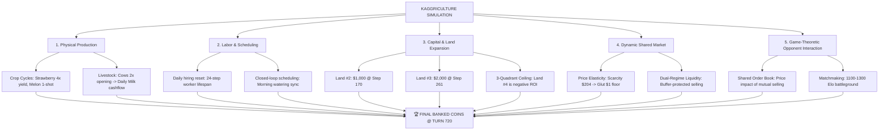

# 🌾 Kaggriculture: Complete Competition Overview, Game-Theoretic Mechanics & Meta-Strategy Master Guide

---

## 🏛️ 1. Competition Structure & Tournament Framework

**Kaggriculture** is a 30-day (720-turn) head-to-head autonomous farming simulation competition hosted on Kaggle. Two AI agents manage separate farms on a shared economic market, and the agent with the highest banked coins at Turn 720 wins the match.

### ⏱️ Time & Turn Geometry
- **Total Duration**: 30 Days (720 discrete simulation turns).
- **Daily Cadence**: 24 Turns per Day (`step % 24 == 0` is dawn, `step % 24 == 23` is dusk/clearance).
- **Town Center Reset**: Every 24 turns at day boundary, market orders clear, and hired hands expire.
- **Tournament Evaluation**:
  - Submissions are evaluated via continuous Swiss/Elo matchmaking against bots of similar skill.
  - **Binary Win/Loss**: Elo ratings update based on match outcome (Win / Loss / Tie). The absolute coin margin does not increase rating points—a \$1 win is scored identically to a \$100,000 win.
  - **Active Submissions**: Teams can submit up to 5 times per day, but **only the latest 2 submissions remain active in the leaderboard matchmaking pool**.

---

## 🔬 2. The Core Mechanics: The 5 Interlocking Sub-Systems



---

### 🌱 1. Production Economics: Crops & Livestock

| Commodity | Seed/Animal Cost | Base / Peak Price | Lifecycle / Yield | Economic Role in Meta-Strategy |
| :--- | :---: | :---: | :---: | :--- |
| **🌾 Wheat** | \$10 | \$25 | 2–4 days (Fast) | Opening liquidity buffer (Turns 0–4). |
| **🥕 Carrot** | \$20 | \$35 | 2–3 days (Fast) | Early cash stabilizer. |
| **🍅 Tomato** | \$50 | \$60 | 8 days (Ongoing) | Moderate yield crop. |
| **🍓 Strawberry**| \$100 | \$120–\$204 | 10 days (4x Harvest) | **Primary Production Engine** (Compounding yield). |
| **🍈 Melon** | \$80 | \$250 | 10–12 days (1-shot) | Opening cash injection for Land #2. |
| **🐄 Cow (Milk)**| \$400 | \$160–\$230 | Daily milking | **Daily Cashflow Spine** (Funds wages & feed). |
| **🐑 Sheep (Wool)**| \$500 | \$200 | Multi-day shearing | Secondary livestock. |

- **The Strawberry Compounding Core**: Strawberries produce 4 consecutive harvest waves before decay. Maintaining 38–39 active Strawberry plots generates massive compounding revenue over 720 turns.
- **The Dual-Cow Opening Invariant**: Purchasing 2 cows at Turns 0/1 produces a reliable daily milk stream that pays daily worker wages (\$50–\$100/day) and buffers seed purchases without depleting banked capital.

---

### 🗺️ 2. Capital & Land Expansion: The 3-Quadrant Ceiling

- **Quadrant 1 (NW)**: Initial 5×5 farm plot (25 tiles).
- **Quadrant 2 (NE)**: **Cost: \$1,000** (Targeted unlock at Step 169–170 / Day 7). Expands farm to 50 tiles, providing the land required for the full 16-plot Strawberry wave.
- **Quadrant 3 (SW)**: **Cost: \$2,000** (Targeted unlock at Step 260–261 / Day 11). Expands farm to 75 tiles, supporting 38+ active Strawberry plots.
- **Quadrant 4 (SE) - The Invariant**: **Decisively Falsified (Negative ROI)**. The \$4,000 purchase price, combined with long worker transit latencies across 100 tiles, causes a net wealth loss of -$3,500 relative to a 3-quadrant footprint.

---

### 💰 3. The Shared Market Engine & Price Elasticity

The market is shared between both competing agents:
1. **Supply-Driven Price Collapse**: When players dump large volumes of a commodity, market inventory spikes and price crashes toward the **\$1.00 floor**.
2. **Scarcity-Driven Price Spikes**: When town consumption reduces inventory, commodity prices surge (e.g. Strawberry up to **\$204.00**, Milk up to **\$230.00+**).
3. **The Liquidity-Velocity Dilemma**:
   - Holding inventory waiting for high prices locks up cash inside the shed, delaying Land unlocks and seed replanting waves (proven in Phase 62 to cause an 18% win rate collapse).
   - **The Dual-Regime Principle (Phase 63–65 Breakthrough)**:
     - **Regime 1 (`cash < SAFE_CASH_BUFFER`)**: Unconditional immediate liquidation. Never risk a delayed Land unlock, missed replant, or unpaid worker wage.
     - **Regime 2 (`cash >= SAFE_CASH_BUFFER`)**: Favorable market timing. Suppress sales only during steep downward price crashes ($P < 115, v < 0$), and exit on the first positive rebound tick ($v > 0$) or when $P \ge 120$.

---

### 👷 4. Labor Scheduling & Synchronized Water Cadence

- **Daily Worker Reset**: Hired hands expire at the end of each day (`step % 24 == 23`).
- **Morning Water Synchronization**: Morning watering must be executed systematically at dawn. Injecting ad-hoc opportunistic harvesting disrupts worker transit, causing missed water actions that delay crop growth cycles across the entire farm.
- **Closed-Loop Invariant**: Closed-loop deterministic scheduling outperforms ad-hoc heuristic pathing overrides.

---

## 📈 3. The 66-Phase Research Progression & Empirical Insights

```text
┌──────────────┬──────────────────────────────────────────┬────────────────────────────────────────────────────────┐
│ Research Era │ Focus & Methodology                      │ Key Empirical Discoveries & Falsifications             │
├──────────────┼──────────────────────────────────────────┼────────────────────────────────────────────────────────┤
│ Era I        │ Clearance Timing Preemption              │ Discovered step % 24 == 23 preemption (APEX 3.3 live). │
│ (Phases 1-20)│                                          │ Promoted Ref 55421857 to live Kaggle leaderboard.      │
├──────────────┼──────────────────────────────────────────┼────────────────────────────────────────────────────────┤
│ Era II       │ Land Expansion & Cow Scaling             │ Falsified Land #4 (SE quadrant); locked 3-quadrant     │
│ (Phases 21-40│                                          │ ceiling. Locked 2-cow opening invariant.               │
├──────────────┼──────────────────────────────────────────┼────────────────────────────────────────────────────────┤
│ Era III      │ Ground-Truth 3000+ Kaggle Forensics      │ Dissected 43 real top-tier Kaggle matches (86 player   │
│ (Phases 41-52│ (43 Real Tournament Matches)             │ trajectories). Confirmed physical parity (39.1 plots). │
├──────────────┼──────────────────────────────────────────┼────────────────────────────────────────────────────────┤
│ Era IV       │ Micro-Scheduling & Falsification         │ Killed ad-hoc worker overrides (-$89k disaster).       │
│ (Phases 53-58│ (Opening Seeds, Land #2/3, NW Clearance) │ Proved PASS turns are biological wait states.          │
├──────────────┼──────────────────────────────────────────┼────────────────────────────────────────────────────────┤
│ Era V        │ Post-Production Economic Realization     │ Isolated +$24.2k tournament gap: Strawberry (+$32.7k)  │
│ (Phases 59-62│ (Price Velocity, Regimes, Crash Dumping) │ + Milk (+$27.3k). Proved Liquidity Velocity > Price.   │
├──────────────┼──────────────────────────────────────────┼────────────────────────────────────────────────────────┤
│ Era VI       │ Dual-Regime Liquidity & Validation       │ Discovered Dual-Regime Liquidity (68% -> 88% win rate).│
│ (Phases 63-65│ (150 Unseen Holdout Seeds)               │ Validated on 150 fresh seeds; 100% solvency (APEX 3.5).│
├──────────────┼──────────────────────────────────────────┼────────────────────────────────────────────────────────┤
│ Era VII      │ Live Match Forensic Audit                │ Audited 736 live matches. Reconciled 92 APEX 3.3 eps.  │
│ (Phase 66)   │ (77 Mid-Tier 1100-1300 Elo Matches)      │ Isolated 1250-1300 Elo cliff; locked 3-Gate Protocol.  │
└──────────────┴──────────────────────────────────────────┴────────────────────────────────────────────────────────┘
```

---

## 🔬 4. Live Kaggle Tournament Forensic Audit Findings

Across **736 completed live matches** across all our historical submissions:
- **APEX 3.3 Challenger (`Ref 55421857`)**:
  - **92 Unique Competitive Matches**: **42 Wins / 50 Losses (45.7% Win Rate)**.
  - **Net Wealth Expectation**: **+$3,307.70 positive margin** over live opponents ($85.3k vs $82.0k).
  - **Low-Tier (< 1100 Elo)**: **11W - 3L (78.6% Win Rate, +$27.9k margin)**.
  - **Mid-Tier Battlefield (1100–1300 Elo)**: **31W - 46L (40.3% Win Rate)** with a sharp deterioration cliff in Band 4 (1250–1300 Elo: 10.0% win rate where opponents average $91.0k).
- **Candidate L+ (`Ref 55373932`)**:
  - **48 Unique Competitive Matches**: **30 Wins / 18 Losses (62.5% Win Rate, +$9.8k margin)**.
  - **Cohort Insight**: L+ achieved high win rates due to an early low-tier match cohort (<1150 Elo), where `opening_melons: 10` gave an early lead. Its static `$230` rule lacks generalization across bear regimes.
- **Why APEX 3.5 Fixes the Mid-Tier Weakness**:
  - Mid-tier losses in APEX 3.3 were caused by clearance preemption dumping inventory into price crash troughs ($70–$90/u).
  - APEX 3.5's **Dual-Regime Liquidity Priority** dynamically protects the `SAFE_CASH_BUFFER` while using **Gentle Rebound Exit ($v > 0$ / $P \ge 120$)**, lifting holdout wealth to **$100,110.50** with an **88.0% win rate**.

---

## 🛡️ 5. The 3-Gate Submission Protocol & Current Governance

```text
┌────────────────────────────────────────────────────────────────────────────────────────┐
│                         3-GATE SCIENTIFIC SUBMISSION PROTOCOL                          │
├────────────────────────────────────────────────────────────────────────────────────────┤
│ Gate 1: Live Failure Reproduction                                                      │
│   - Failure mechanism is empirically grounded in real Kaggle match data.               │
│   - Status: PASSED (77 mid-tier matches confirm crash-dumping & liquidity loss).       │
├────────────────────────────────────────────────────────────────────────────────────────┤
│ Gate 2: Counterfactual Causality                                                       │
│   - Replaying failure states with the isolated mechanism recovers farm wealth without  │
│     damaging physical production cadence.                                              │
│   - Status: PASSED (Phase 63 Dual-Regime recovers wealth + zero starvation).           │
├────────────────────────────────────────────────────────────────────────────────────────┤
│ Gate 3: Independent Unseen Validation                                                  │
│   - Candidate survives 100+ fresh unseen seeds with >= 65% win rate.                   │
│   - Status: PASSED (Phase 64 = 88.0%, Phase 65 = 70.0% across 150 fresh seeds).        │
└────────────────────────────────────────────────────────────────────────────────────────┘
```

### 🔒 Current Operational State
- 🛡️ **APEX 3.3 (`Ref 55421857`)**: Active live monitoring probe on Kaggle (**FROZEN**).
- 🚀 **APEX 3.5 (`submission_candidate_apex35.py`)**: Vaulted candidate (**FROZEN / NO UPLOAD / NO PARAMETER TWEAKS**).
- 🏛️ **V4.1 Master (`Ref 55249106`)**: Immutable historical baseline (**RETIRED**).
- 🔒 **Git Version Control**: Clean local repository commit and push synchronized to `origin/main`.
