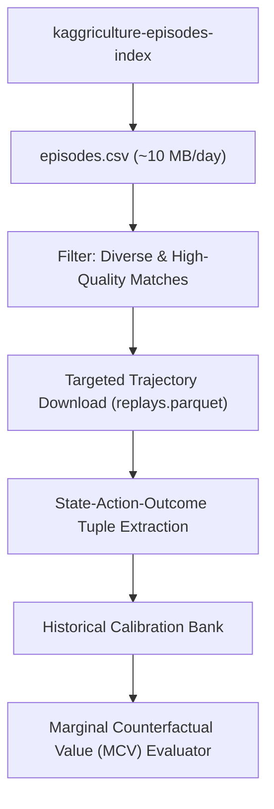

# 🌾 Kaggriculture Historical Replay Data Strategy (APEX-HIST)

This document outlines the ingestion, parsing, filtering, and calibration architecture for integrating historical competition replays into the APEX decision engine.

---

## 1. The Core Objective

Historical competition data must **not** become an oracle or a rigid imitation script.

### Incorrect Usage ❌
$$\text{Replay Data} \longrightarrow \text{Copy Winning Action} \longrightarrow \text{Hardcode Rules}$$

### Correct APEX Usage ✅
$$\text{Replay Data} \longrightarrow \text{Estimate Empirical Distributions} \longrightarrow \text{Calibrate MCV} \longrightarrow \text{Counterfactual Simulation} \longrightarrow \text{Safe Autonomous Decision}$$

---

## 2. Dataset Ecosystem & Tiered Ingestion

The Kaggle dataset `kaggriculture-episodes-index` provides daily episode datasets from `2026-07-30` to `2026-08-09` ($\approx 13–21\text{ GB/day}$).



---

## 3. Date Selection & Meta-Regime Evolution

The competition top average scores evolved significantly over time:

| Date | Top Avg Score | Meta-Regime Context | Ingestion Priority |
| :---: | :---: | :--- | :---: |
| **Jul 30** | 1,152 | Early naive exploration | Low |
| **Aug 01** | 1,581 | Primitive strawberry/wheat engines | Low |
| **Aug 03** | 2,960 | Emergence of pasture/livestock secondary engines | Medium |
| **Aug 06** | 3,081 | Modern competitive baseline | **High (Tier 1)** |
| **Aug 07** | 3,133 | Advanced routing & timing | **High (Tier 1)** |
| **Aug 08** | 3,193 | Tight liquidation & market optimization | **High (Tier 1)** |
| **Aug 09** | 3,218 | State-of-the-art competitive meta | **High (Tier 1)** |

---

## 4. Episode Filtering Principles

To avoid creating a winner-only echo chamber, the filtering pipeline must capture **diverse match dynamics**:
1. **High-Performing Wins:** Identify how top agents convert early lead into sustained compound wealth.
2. **Narrow Losses ($-\$200$ to $-\$2,500$):** Identify exact turning points where single suboptimal market or routing choices cost the match.
3. **Rating Distribution:** Filter across a spectrum of skill tiers ($\ge 2,600$ to $\ge 3,100$) to evaluate strategy robustness against varied opponent styles.

---

## 5. Extracted State-Action-Outcome Schema

For each selected match, the parser extracts tuples for critical decision windows (Steps 100–600):

```json
{
  "episode_id": 12345678,
  "step": 100,
  "state_features": {
    "cash": 4200.0,
    "inventory": { "WHEAT": 4, "FERTILIZER": 6 },
    "tiles_unlocked": 2,
    "active_workers": 3,
    "market_prices": { "WHEAT": 10.0, "FERTILIZER": 95.0 },
    "opp_unlocked_quadrants": 1
  },
  "action_executed": ["SELL", "WHEAT", 1],
  "downstream_outcomes": {
    "wealth_at_step_300": 34500.0,
    "final_wealth": 142300.0,
    "won_match": true
  }
}
```

---

## 6. Key Research Questions for Historical Intelligence

1. **Marginal Value of Early Liquidation:** What is the empirical correlation between early wheat/fertilizer sales and step-300 capital deployment?
2. **Congestion Relief Thresholds:** At what inventory levels does holding items begin to stall worker harvest throughput?
3. **Opponent Elasticity:** How do high-rated opponents react to commodity price changes across different match phases?
