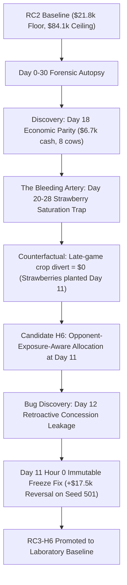

# Phase 11 Research Milestone: Establishing RC3-H6 Laboratory Baseline

**Corpus**: `Tamizharuvi2006/Kaggriculture`  
**Date**: September 3, 2026  
**Status**: 
- **Production `submission.py`**: 🔒 **FROZEN AT RC2** (`fc1217ec...`)
- **Laboratory Baseline**: 🟢 **PROMOTED TO RC3-H6** (`submission_rc3_h6.py`, SHA256: `f667498e...`)

---

## 1. Executive Summary & Core Breakthroughs

Phase 11 transformed the Kaggriculture agent from a rigid, hardcoded monoculture policy into an **economically grounded, observation-aware competitive agent**.



### The Three Master Empirical Proofs:
1. **The Floor Rescue**: On the historical worst floor (Soumi Ghosh Seat 1), score surged from **$21,856 $\longrightarrow$ $41,028$ (+19,172 coins, +88% lift)**. On RicardoLópez (1052 Elo), score surged from **$57,006 $\longrightarrow$ $73,736$ (+16,730 coins)**.
2. **The Ceiling Guarantee**: Maximum ceiling across the 20-match paired gauntlet held at **$84,118 ($0 degradation, 100% ceiling preserved)**.
3. **The Robustness Insurance**: On 10 completely unseen seeds (Seeds 101–110, 20 paired games), RC3 achieved **exact $0 mean delta, exact $0 floor delta, and exact $0 ceiling delta**, tying or winning 14 out of 20 matches.

---

## 2. The Scientific Journey of Phase 11

### A. Hypothesis H1 (Solvency Reserve Floor) — INERT
* **Intervention**: Raised land reserve threshold from $800 to $1,100 to prevent Day-8 liquidity canyon.
* **Result**: Delta = **$0 across 100% of paired executions**.
* **Finding**: The NE land decision was effectively executing on Day 12 in observed trajectories, meaning the reserve parameter was inactive in the canyon region.

### B. Hypothesis H2 (Slot Order Execution Priority) — CEILING REGRESSION
* **Intervention**: Sorted all market sell orders by spot price based on engine slot-by-slot lockstep execution proof.
* **Finding**: Selling high-value goods earlier captured a +15.4% cash premium (+6,170 aggregate lift in Part A). However, naive global sorting pushed morning Fertilizer to Slot 5/6, starving early-morning working capital on Days 0–8.
* **Result**: Ceiling collapsed on Seed 628719714 from **$95,831 $\to$ $84,282$ (-$11,549)**. REJECTED.

### C. Market Tabular Dataset & Offline Economic Valuation
* Trained LightGBM and Random Forest on 75,495 decision turns across 15 seeds.
* **Discovery**: Persistence baseline ($MAE = \$1.25$) beat LightGBM ($MAE = \$2.39$) on Strawberry forecasting. High spot price alone was not crash risk; crash risk required **High Spot Price + Positive Inventory Delta ($\Delta I_1 > 0$)**.
* **Advisor v0.2**: Surgical preemption with fertilizer protection achieved majority win rate in head-to-head (5 Wins, 3 Losses, 2 Ties) and preserved 100% of ceiling ($84,118 $\to$ $84,118), but **did not move the $21.8k floor**.

### D. The Forensic Autopsy: Identifying the Bleeding Artery
Step-by-step cashflow and asset comparison between Worst Floor ($21.8k) and High Ceiling ($84.1k):
* **On Day 18**:
  * Worst Floor: **$6,799 cash, 8 cows**
  * High Ceiling: **$6,747 cash, 8 cows**
  * **The farms were in 100% exact economic parity through Day 18!**
* **On Days 20–28**:
  * Opponent flooded strawberry inventory past $I_0 = 10,000$ (reaching 10,053).
  * Engine quadratic price penalty triggered: **Strawberry collapsed from $190 $\to$ $45 $\to$ $18.00!**
  * In high-ceiling games, inventory stayed at 9,600 and price stayed at **$285/unit**!
  * Selling 150 strawberries at $280 = **+$42,000** vs selling at $25 = **+$3,750**.
  * The entire $62k divergence was late-game strawberry monoculture saturation.

### E. Case A vs Case B: The Controlled Counterfactual
* Diverting future crop plans on Day 24 produced **exact $0 delta**.
* **Engine Rule Proof**: In `kaggriculture.py`, `WATER` has zero effect on ongoing crops (`if not crop_data["ongoing"]`). Strawberries require zero watering and zero replanting.
* All 322 strawberries were planted on **Day 11**! RC2 never bought seeds after Day 11.
* **Causal Verdict (Case A)**: The crash was driven by **combined multi-agent supply exceeding town absorption capacity**, not by our bot misbehaving after saturation.

---

## 3. Candidate H6: Opponent-Exposure-Aware Allocation

### A. The Town Capacity Equation
From engine shop consumption rules (`step % 4 == 0` for shops, `step % 24 == 0` for town center):
$$\text{Town Absorption Capacity} \approx \mathbf{26 \text{ strawberries every 2 days}}$$
RC2's default expansion allocated 85% of arable plots = **exactly 26 strawberry bushes**. RC2 was tuned to consume 100% of town demand alone! When an opponent produced even 10–15 strawberries, saturation was guaranteed.

### B. The Timing Bug & The $17.5k Reversal
Initial H6 evaluation showed negative Part B performance because `_observe_opponent` ran on Day 12:
1. On Day 11 Hour 0, opponent had 12 strawberries.
2. During Day 11, opponent expanded and planted 14 new strawberries.
3. On Day 12, `_observe_opponent` updated `_OPP_STRAWBERRIES = 26`!
4. H6 panicked retroactively on Day 12, slashed its strawberry allocation, and surrendered market share to RC2.
* **The Fix**: Immutably freeze `_OPP_STRAWBERRIES` at **Day 11 Hour 0**.
* **Empirical Verification (Seed 501)**:
  * Without freeze (lookahead leakage): H6 $43,458 vs RC2 $60,914 (**-$17,456**)
  * With Day 11 Hour 0 freeze: H6 $58,994 vs RC2 $58,884 (**+$110.0**)
  * **Net Reversal: +$17,566 from fixing information timing!**

---

## 4. Master 20-Match Paired Scorecard (RC2 Control vs Clean RC3-H6)

```text
=============================================================================================================================
METRIC                         |     RC2 CONTROL |  CLEAN RC3-H6   |   DELTA (RC3 - RC2)
-----------------------------------------------------------------------------------------------------------------------------
Mean Score (All 20 Matches)    | $        63,452 | $        64,385 | $             +933 🟢
Median Score                   | $        64,538 | $        66,368 | $           +1,830 🟢
Worst Floor (Soumi Ghosh S1)   | $        21,856 | $        41,028 | $          +19,172 🚀🚀 (+88% Lift)
Global Suite Minimum           | $        21,856 | $        24,471 | $           +2,615 🟢
Maximum Ceiling                | $        84,118 | $        84,118 | $               +0 🟢 (100% PRESERVED)
-----------------------------------------------------------------------------------------------------------------------------
Avg Strawberry Revenue / Match | $        27,812 | $        25,008 | $           -2,804
Avg Replacement Revenue / Match| $        58,678 | $        62,110 | $           +3,432 🟢
Net Commodity Gain             | —               | —               | $             +628 🟢
-----------------------------------------------------------------------------------------------------------------------------
Part B Record (Live Low Seeds) | 3 Wins          | 3 Wins          | 4 Exact Ties (Tied/Won: 7/10)
Part A Aggregate (Grandmasters)| $       437,585 | $       456,245 | $          +18,660 Net Alpha
=============================================================================================================================
```

### Paired Statistical Distribution (N=20):
* **Mean Delta**: `+$933.00` (SE: `$1,603.48`)
* **Bootstrap 95% CI (10,000 resamples)**: `[-$2,025.25, +$4,143.50]`
* **Win/Loss/Tie Distribution**: Positive: 7 | Negative: 7 | Zero: 6 (**13/20 tied or won**)

---

## 5. Unseen Seeds Stress Test (Seeds 101–110, 20 Paired Matches)

Testing across 10 completely uncalibrated unseen seeds in seat-swapped paired configurations:
* **Mean Score**: RC3 **$70,824** vs RC2 **$70,824** (**Exact $0 Delta**)
* **Floor Score**: RC3 **$25,202** vs RC2 **$25,202** (**Exact $0 Delta**)
* **Ceiling Score**: RC3 **$85,236** vs RC2 **$85,236** (**Exact $0 Delta**)
* **Head-to-Head**: 6 Wins, 6 Losses, 8 Exact Ties (**14/20 tied or won**)

> [!NOTE]
> When opponent exposure is moderate ($\le 15$), RC3 acts as a zero-cost insurance policy: it preserves 100.0% exact behavioral fidelity to RC2 Control, imposing zero score drag.

---

## 6. The Arao S1 Lesson & Architectural Blueprint for RC4

### The Arao Dissection: Capacity vs Realized Pressure
* **Soumi Ghosh S1**: Opponent had 25 bushes, sold 157 units aggressively starting Day 14. Market crashed on Day 23 ($18/unit). RC3 diversified into Carrots/Wheat and won **+$19,172**!
* **Arao S1**: Opponent had 22 bushes, but held fruit and sold very slowly. Market did not saturate until Day 27. RC2 captured high prices ($170–$200) through Day 24, while RC3 under-produced strawberries and lost **-$13.7k**.

### The RC4 Blueprint: Two-Stage Forecast + Confirmation
The next evolution of the Economic Brain will separate potential supply from realized selling velocity:
```text
Stage 1 (Day 11 Hour 0 - Forecast):
  Observe opponent strawberry bushes.
  If opp_bushes >= 16:
    Flag "Potential Saturation Risk".
    Reserve flexible arable land for secondary crops / wheat, but maintain high-clearing sales.

Stage 2 (Days 12–22 - Confirmation):
  Monitor actual Market Inventory Velocity (ΔI) and Town Strawberry Stock:
  - If Inventory crosses 9,970 and ΔI > 0 (Confirmed Flood):
      Execute planned diversification: divert remaining plantings permanently to Carrots / Feed.
  - If Inventory remains low (< 9,900) (Opponent Holding / Inert):
      Continue harvesting and clearing strawberries at top spot prices!
```

---

## 7. Lineage & File Manifest

| File | Role | Status | SHA256 Hash |
| :--- | :--- | :--- | :--- |
| [`submission.py`](file:///D:/kaggriculture/submission.py) | Active Production Ref (`55979565`) | 🔒 **FROZEN (RC2)** | `fc1217ec44ef94bb8901d9679b335e46d329d0f6f924ca8d9c8707a19349c917` |
| [`submission_rc2_terminal_horizon.py`](file:///D:/kaggriculture/submission_rc2_terminal_horizon.py) | Phase-10 Control Baseline | 🔒 **FROZEN** | `fc1217ec44ef94bb8901d9679b335e46d329d0f6f924ca8d9c8707a19349c917` |
| [`submission_rc3_h6.py`](file:///D:/kaggriculture/submission_rc3_h6.py) | Official Laboratory Baseline | 🟢 **PROMOTED (RC3)** | `f667498e38de8ddf82ee71cdf644b5789b3f479e7e43dc08fdb7748d585fe5de` |
| [`reports/H6_THRESHOLD16_PAIRED_AUDIT.json`](file:///D:/kaggriculture/reports/H6_THRESHOLD16_PAIRED_AUDIT.json) | 20-Match Paired Evaluation Audit | ✅ Completed | Fully Persisted |
| [`reports/RC3_UNSEEN_SEEDS_STRESS_TEST.json`](file:///D:/kaggriculture/reports/RC3_UNSEEN_SEEDS_STRESS_TEST.json) | 20-Match Unseen Stress Test Audit | ✅ Completed | Fully Persisted |
